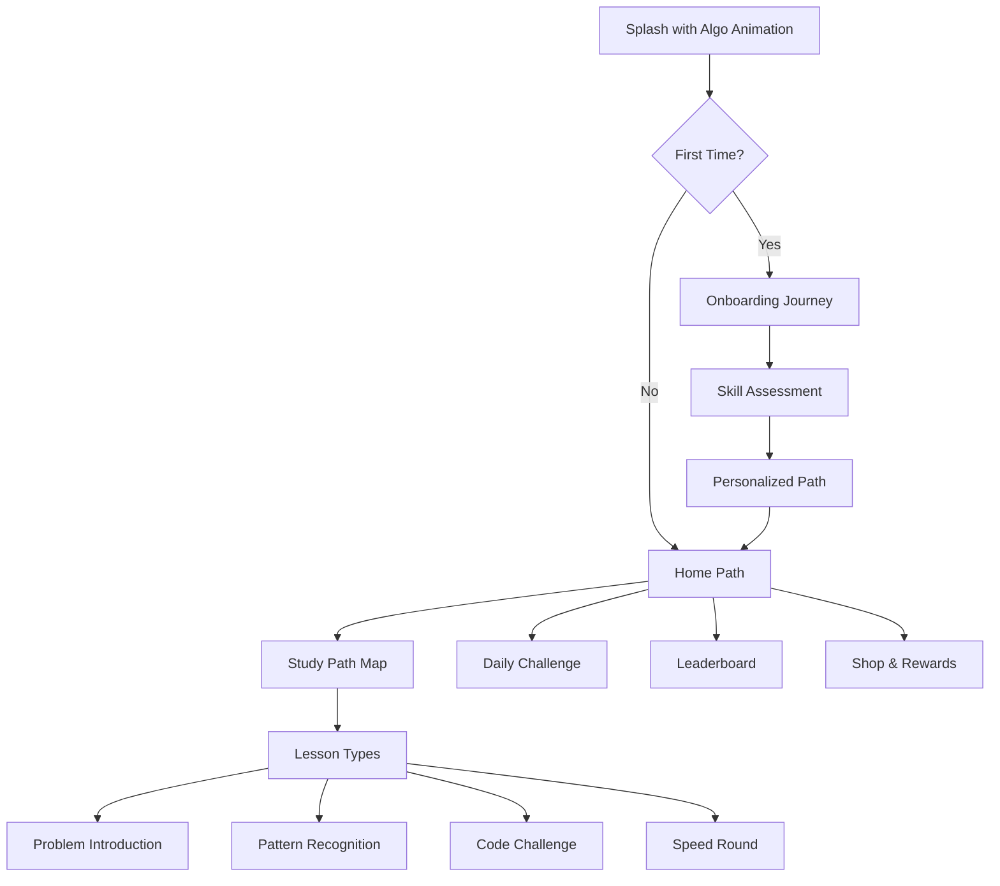

# LeetCode Flashcards App - Design Document

## 📱 Project Overview

A cross-platform mobile application designed to help developers master LeetCode problems through spaced repetition and structured learning paths. The app focuses on the Grind 75 problem set while supporting custom problem collections.

## 🎯 Goals & Objectives

### Primary Goals
- **Efficient Learning**: Implement spaced repetition algorithm for optimal retention
- **Complete Problem Set**: Access to all 169 Grind75 problems without restrictions
- **Multi-Language Support**: Solutions in Python, Java, JavaScript, and more
- **Gamification**: Streak tracking, achievements, and progress visualization
- **Cross-Platform**: Support iOS, Android, and Web platforms

### Target Audience
- Software engineers preparing for technical interviews
- Computer science students learning algorithms
- Developers wanting to improve problem-solving skills

## 🏗️ Architecture

### Technology Stack

```yaml
Frontend:
  - Framework: Flutter/Dart
  - State Management: Provider
  - Local Storage: SQLite, SharedPreferences
  - UI Components: Material Design 3

Backend (Recommended: Supabase):
  - Supabase Auth (authentication)
  - Supabase Database (PostgreSQL)
  - Supabase Storage (file storage)
  - Supabase Realtime (live updates)

Code Features:
  - Syntax Highlighting: flutter_highlight
  - Animations: flip_card, flutter_card_swiper
  - Progress Tracking: percent_indicator
```

### Backend Comparison: Firebase vs Supabase

#### **Supabase (Recommended) ✅**

**Free Tier Limits:**
- **Database**: 500 MB storage, unlimited API requests
- **Storage**: 1 GB file storage, 2 GB bandwidth
- **Auth**: Unlimited users (50,000 MAU)
- **Realtime**: 200 concurrent connections
- **Edge Functions**: 500,000 invocations/month
- **No credit card required**

**Pros:**
- 🆓 **More generous free tier** - Perfect for MVP and scaling
- 🐘 **PostgreSQL** - Full SQL database with advanced features
- 🔓 **Open source** - Self-hostable if needed
- 📊 **Better for complex queries** - SQL joins, views, functions
- 🎯 **Row Level Security** - Fine-grained access control
- 💰 **Predictable pricing** - No surprise bills
- 🚀 **Faster queries** - Direct database access
- 📦 **Built-in REST API** - Auto-generated from schema

**Cons:**
- 📚 Smaller community than Firebase
- 🔧 Requires SQL knowledge
- 📱 Fewer Flutter packages/examples

**Best For:** This LeetCode flashcards app! The generous auth limits and PostgreSQL features are perfect for our needs.

#### **Firebase**

**Free Tier Limits:**
- **Firestore**: 1 GB storage, 50K reads/20K writes per day
- **Storage**: 5 GB storage, 1 GB/day bandwidth
- **Auth**: Unlimited users (but phone auth limited)
- **Hosting**: 10 GB storage, 360 MB/day transfer
- **Functions**: 125K invocations/month
- **Credit card required for some features**

**Pros:**
- 👥 **Huge community** - Lots of tutorials and support
- 🔌 **Better Flutter integration** - Official packages
- 📱 **Mobile-first design** - Built for apps
- ⚡ **Real-time by default** - Live sync everywhere
- 🎯 **Simple to start** - NoSQL is easier for beginners

**Cons:**
- 💸 **Expensive at scale** - Costs grow quickly
- 🔒 **Vendor lock-in** - Hard to migrate away
- 🐌 **Limited queries** - No SQL joins or complex queries
- 📊 **NoSQL limitations** - Harder for relational data
- ⚠️ **Surprise bills** - Many horror stories

**Best For:** Simple apps with real-time needs and small datasets.

### 📊 Cost Analysis for Our App

#### Estimated Usage (1000 active users):
- **Auth**: ~1000 MAU
- **Database**: ~100 MB data
- **Storage**: ~50 MB (profile pics, etc.)
- **API calls**: ~100K/month

#### Monthly Cost:
- **Supabase**: **$0** (well within free tier)
- **Firebase**: **$0-25** (may exceed free tier for reads)

#### At 10,000 users:
- **Supabase**: **$0** (still free!)
- **Firebase**: **$50-200** (definitely exceeds free tier)

### 🎯 Recommendation: Supabase

For this LeetCode flashcards app, **Supabase is the better choice** because:

1. **Free tier covers our needs** - Even with thousands of users
2. **PostgreSQL is perfect** - Relational data (flashcards, progress, etc.)
3. **Complex queries** - Analytics, leaderboards, progress tracking
4. **No surprise bills** - Predictable, generous limits
5. **Open source** - Can self-host if needed
6. **Row Level Security** - Protect user data properly

### Implementation with Supabase

```yaml
dependencies:
  supabase_flutter: ^2.3.0  # Instead of Firebase packages
```

```dart
// Initialize Supabase
await Supabase.initialize(
  url: 'YOUR_SUPABASE_URL',
  anonKey: 'YOUR_SUPABASE_ANON_KEY',
);

// Authentication
final user = await Supabase.instance.client.auth.signUp(
  email: email,
  password: password,
);

// Database operations
final flashcards = await Supabase.instance.client
  .from('flashcards')
  .select('*, solutions(*)')
  .eq('difficulty', 'Medium')
  .order('grind75_order');

// Real-time subscriptions
Supabase.instance.client
  .from('leaderboard')
  .stream(primaryKey: ['user_id'])
  .listen((data) {
    // Update leaderboard in real-time
  });
```

### App Structure

```
lib/
├── main.dart                 # App entry point
├── models/                   # Data models
│   ├── flashcard.dart       # Flashcard model with solutions
│   ├── user.dart            # User profile and settings
│   └── study_session.dart   # Study session tracking
├── providers/               # State management
│   ├── auth_provider.dart   # Authentication state
│   ├── flashcard_provider.dart # Flashcard operations
│   └── study_session_provider.dart # Session management
├── screens/                 # UI screens
│   ├── auth/               # Authentication screens
│   ├── home/               # Main dashboard
│   ├── study/              # Study mode screens
│   └── progress/           # Progress tracking
├── widgets/                # Reusable components
│   ├── flashcard_widget.dart
│   ├── code_viewer.dart
│   └── progress_chart.dart
├── services/               # Business logic
│   ├── database_service.dart  # SQLite operations
│   ├── import_service.dart    # Data import/export
│   └── sync_service.dart      # Cloud sync (future)
├── utils/                  # Utilities
│   ├── spaced_repetition.dart
│   └── theme.dart
└── repositories/           # Data access layer
    ├── flashcard_repository.dart
    └── progress_repository.dart

assets/
├── database/
│   └── leetcode_flashcards.db  # Pre-populated SQLite database
└── data/
    └── updates/                 # JSON update files
```

## 📊 Data Models

### Flashcard Model
```dart
class Flashcard {
  String id;
  String title;
  String leetcodeNumber;
  String question;
  String hint;
  Map<String, CodeSolution> solutions;  // Language -> Solution
  String dataStructureCategory;
  String algorithmPattern;
  String predefinedDifficulty;
  // Note: Week-based study plan removed - will be future personalized feature
  List<String> tags;
  List<String> companies;
  
  // Spaced Repetition Fields
  DateTime? lastReviewed;
  DateTime? nextReview;
  int reviewCount;
  double easeFactor;
  int consecutiveCorrect;
}

class CodeSolution {
  String code;
  String timeComplexity;
  String spaceComplexity;
  List<String> keyPoints;
  String approach;
}
```

### User Model
```dart
class User {
  String id;
  String email;
  String? displayName;
  UserProgress progress;
  UserSettings settings;
  DateTime createdAt;
  DateTime lastActiveAt;
}

class UserProgress {
  int totalSolved;
  int currentStreak;
  int longestStreak;
  Map<String, int> categoryProgress;
  Map<String, double> categoryMastery;
  int grind75Completed;
  List<String> masteredCards;
  List<String> reviewedCards;
}
```

## 🎨 UI/UX Design - Duolingo-Inspired

### Design Philosophy
- **Playful & Engaging**: Bright colors, fun animations, and mascot character
- **Reward-Driven**: Instant feedback, celebrations, and achievements
- **Bite-Sized Learning**: Short sessions with clear progress
- **Social Pressure**: Streaks, leaderboards, and friend challenges

### Color Palette
```dart
// Duolingo-inspired vibrant colors
Primary Green: #58CC02
Success Green: #89E219
Warning Orange: #FF9600
Error Red: #FF4B4B
Electric Blue: #1CB0F6
Purple: #CE82FF
Gold: #FFC800
Dark Text: #3C3C3C
Light Background: #F7F7F7
```

### Mascot Character - "Algo the Algorithm Owl" 🦉
- Appears throughout the app with different emotions
- Celebrates successes with confetti animations
- Looks sad when streak is broken
- Gives encouraging messages and hints
- Animated reactions based on performance

### Screen Flow



### Key Screens with Duolingo-Style UI

#### 1. **Home Path Screen** 🗺️
- **Visual Journey Map**: Scrollable path with nodes (like Duolingo's tree)
- **Animated Progress**: Path lights up as you advance
- **Heart System**: 5 hearts for mistakes (refill over time)
- **Streak Flame**: Prominent streak counter with fire animation
- **XP Progress Bar**: Daily XP goal with satisfying fill animation
- **Algo Mascot**: Sits on current node, waves and encourages

#### 2. **Study Session Screen** 📚
- **Progress Bar**: Top of screen showing session progress
- **Question Types**:
  - **Pattern Match**: Drag and drop code patterns
  - **Fill in the Blanks**: Complete the algorithm
  - **Multiple Choice**: Select correct approach
  - **Code Assembly**: Build solution from blocks
- **Instant Feedback**:
  - ✅ Correct: Screen flash green, coins fly, "Ding!" sound
  - ❌ Wrong: Gentle shake, Algo looks concerned, heart lost
- **Combo Multiplier**: Consecutive correct answers build combo
- **Power-ups**: Skip, Hint, Freeze timer

#### 3. **Achievement & Rewards** 🏆
- **League System**: Bronze → Silver → Gold → Diamond
- **Weekly Tournaments**: Compete with 30 others
- **Achievement Badges**:
  - 🔥 Streak badges (7, 30, 100, 365 days)
  - 🎯 Perfect weeks (no mistakes)
  - ⚡ Speed demon (fast solutions)
  - 🧠 Pattern master (category completion)
- **Outfit Shop**: Dress up Algo with earned coins
- **Power-up Store**: Buy hints, streak freezes, double XP

#### 4. **Problem Presentation** 💡
- **Story Mode**: Problems presented as real-world scenarios
- **Visual Hints**: Animated diagrams for data structures
- **Step-by-Step Reveal**: Solution unfolds progressively
- **Celebration Animations**:
  - Confetti burst on correct answer
  - Algo does a happy dance
  - XP coins cascade down
  - Streak flame grows bigger

### Interactive Elements

#### Animations & Micro-interactions
```dart
// Bounce animation for correct answers
AnimationController bounceController;
Animation<double> bounceAnimation;

// Shake animation for wrong answers  
AnimationController shakeController;
Animation<double> shakeAnimation;

// Confetti particle system
ParticleSystem confetti;

// Coin collection animation
AnimationController coinController;
```

#### Sound Effects 🔊
- **Correct Answer**: Cheerful "ding" + coin collect
- **Wrong Answer**: Gentle "whoosh" 
- **Streak Milestone**: Fanfare
- **Level Up**: Victory music
- **Algo Sounds**: Chirps and hoots

### Gamification Mechanics

#### Daily Mechanics
- **Daily Quests**: 3 daily challenges for bonus XP
- **Double or Nothing**: Risk streak for double XP
- **Lightning Round**: Timed challenges every 4 hours
- **Friend Challenges**: Challenge friends to problem duels

#### Progress Systems
- **XP System**: 
  - Easy problem: 10 XP
  - Medium problem: 20 XP
  - Hard problem: 30 XP
  - Perfect session: +50% bonus
- **Crown System**: Earn crowns for category mastery
- **Skill Tree**: Unlock advanced topics with crowns

### Mobile-First Design Elements

#### Gesture Controls
- **Swipe Right**: Mark as correct/understood
- **Swipe Left**: Mark for review
- **Swipe Up**: Show hint
- **Swipe Down**: Show solution
- **Long Press**: Bookmark problem
- **Pinch**: Zoom code view

#### Responsive Components
```dart
// Adaptive card sizes
class AdaptiveFlashcard extends StatelessWidget {
  @override
  Widget build(BuildContext context) {
    return Container(
      decoration: BoxDecoration(
        gradient: LinearGradient(
          colors: [Color(0xFF58CC02), Color(0xFF89E219)],
        ),
        borderRadius: BorderRadius.circular(20),
        boxShadow: [
          BoxShadow(
            color: Colors.green.withOpacity(0.3),
            blurRadius: 15,
            offset: Offset(0, 10),
          ),
        ],
      ),
    );
  }
}
```

### Notification Strategy 📱
- **Streak Reminders**: "Don't lose your 15-day streak!"
- **Friend Activity**: "Sarah just passed you!"
- **New Content**: "New problems unlocked!"
- **Achievement Unlocked**: "You earned Speed Demon!"
- **Algo Messages**: Personalized encouragement
## 🎮 Gamification Features

### Duolingo-Style Elements

#### Character & Personalization
- **Algo the Owl**: Mascot with 50+ emotions and outfits
- **Avatar Customization**: Unlock outfits, backgrounds, effects
- **Personal Study Room**: Decorate with achievements

#### League System
- **Weekly Leagues**: 
  - Bronze League (Top 10 advance)
  - Silver League (Top 10 advance)
  - Gold League (Top 10 advance)
  - Sapphire League (Top 10 advance)
  - Ruby League (Top 10 advance)
  - Emerald League (Top 5 advance)
  - Amethyst League (Top 3 advance)
  - Pearl League (Top 3 advance)
  - Obsidian League (Top 3 advance)
  - Diamond League (Prestige)

#### Streak & Heart System
- **Streak Freeze**: Purchasable with gems
- **Heart Refills**: 1 heart every 4 hours or buy with gems
- **Unlimited Hearts**: Premium subscription feature
- **Streak Society**: Exclusive club at 365 days

#### Currency System
- **XP**: Experience points for progress
- **Gems** 💎: Premium currency for power-ups
- **Coins** 🪙: Regular currency for cosmetics
- **Crowns** 👑: Category mastery currency

### Power-ups & Boosts
- **2X XP Boost**: 15 minutes of double XP
- **Streak Freeze**: Protects streak for 1 day
- **Problem Skip**: Skip difficult problem
- **Extra Heart**: Add one heart mid-session
- **Timer Freeze**: Pause timer in challenges

## 🔄 Study Modes

### 1. **Spaced Repetition Mode**
- SuperMemo 2 algorithm implementation
- Automatic scheduling based on performance
- Difficulty ratings: Again (1), Hard (2), Good (3), Easy (4)
- Adaptive intervals

### 2. **Grind 75 Mode**
- All 169 Grind75 problems available for practice
- Problems organized by category and difficulty only
- No week-based structure - all problems accessible
- Progress tracking by completion percentage
- Learn at your own pace without artificial restrictions

### 3. **Random Practice**
- Randomly selected problems
- Configurable difficulty mix
- Category selection

### 4. **Timed Challenge**
- Time-boxed problem solving
- Leaderboard integration
- Performance metrics

## 🧮 Spaced Repetition Algorithm

### SuperMemo 2 Implementation

```dart
class SpacedRepetitionCalculator {
  // Calculate next review interval
  static int calculateInterval(int previousInterval, double easeFactor, int quality) {
    if (quality < 3) {
      return 1; // Reset to 1 day
    }
    
    if (previousInterval == 0) {
      return 1;
    } else if (previousInterval == 1) {
      return 6;
    } else {
      return (previousInterval * easeFactor).round();
    }
  }
  
  // Update ease factor based on quality
  static double updateEaseFactor(double currentEF, int quality) {
    double newEF = currentEF + (0.1 - (5 - quality) * (0.08 + (5 - quality) * 0.02));
    return newEF < 1.3 ? 1.3 : newEF;
  }
}
```

## 🎮 Gamification Features

### Achievements System
- **Streak Achievements**: 7, 30, 100 day streaks
- **Category Master**: Complete all problems in a category
- **Week Champion**: Complete a Grind 75 week
- **Speed Demon**: Solve problems under time limit
- **Polyglot**: View solutions in 3+ languages

### Progress Indicators
- XP points per problem solved
- Level system based on total XP
- Category-specific mastery levels
- Weekly leaderboards

## 📦 Local Storage Schema

### SQLite Database Design

```sql
-- Main flashcards table
CREATE TABLE flashcards (
  id TEXT PRIMARY KEY,
  title TEXT NOT NULL,
  leetcode_number TEXT NOT NULL,
  question TEXT NOT NULL,
  hint TEXT,
  data_structure_category TEXT NOT NULL,
  algorithm_pattern TEXT NOT NULL,
  difficulty TEXT NOT NULL CHECK (difficulty IN ('Easy', 'Medium', 'Hard')),
  created_at INTEGER NOT NULL,
  updated_at INTEGER NOT NULL
);

-- Solutions table (supports multiple languages per problem)
CREATE TABLE solutions (
  id TEXT PRIMARY KEY,
  flashcard_id TEXT NOT NULL,
  language TEXT NOT NULL,
  code TEXT NOT NULL,
  time_complexity TEXT NOT NULL,
  space_complexity TEXT NOT NULL,
  approach TEXT NOT NULL,
  key_points TEXT,  -- JSON array
  FOREIGN KEY (flashcard_id) REFERENCES flashcards(id) ON DELETE CASCADE,
  UNIQUE(flashcard_id, language)
);

-- Tags table
CREATE TABLE tags (
  id TEXT PRIMARY KEY,
  name TEXT NOT NULL UNIQUE,
  category TEXT  -- 'company', 'topic', 'pattern'
);

-- Flashcard-tags junction table
CREATE TABLE flashcard_tags (
  flashcard_id TEXT NOT NULL,
  tag_id TEXT NOT NULL,
  PRIMARY KEY (flashcard_id, tag_id),
  FOREIGN KEY (flashcard_id) REFERENCES flashcards(id) ON DELETE CASCADE,
  FOREIGN KEY (tag_id) REFERENCES tags(id) ON DELETE CASCADE
);

-- User review history
CREATE TABLE review_history (
  id TEXT PRIMARY KEY,
  flashcard_id TEXT NOT NULL,
  reviewed_at INTEGER NOT NULL,
  quality INTEGER NOT NULL CHECK (quality BETWEEN 1 AND 4),
  time_spent INTEGER,  -- in seconds
  FOREIGN KEY (flashcard_id) REFERENCES flashcards(id) ON DELETE CASCADE
);

-- Spaced repetition data
CREATE TABLE spaced_repetition (
  flashcard_id TEXT PRIMARY KEY,
  last_reviewed INTEGER,
  next_review INTEGER NOT NULL,
  interval_days INTEGER DEFAULT 0,
  ease_factor REAL DEFAULT 2.5,
  consecutive_correct INTEGER DEFAULT 0,
  total_reviews INTEGER DEFAULT 0,
  average_quality REAL DEFAULT 0,
  FOREIGN KEY (flashcard_id) REFERENCES flashcards(id) ON DELETE CASCADE
);

-- Study sessions table
CREATE TABLE study_sessions (
  id TEXT PRIMARY KEY,
  mode TEXT NOT NULL,
  started_at INTEGER NOT NULL,
  ended_at INTEGER,
  cards_studied INTEGER DEFAULT 0,
  cards_mastered INTEGER DEFAULT 0,
  accuracy REAL,
  data TEXT  -- JSON encoded session details
);

-- User progress table
CREATE TABLE user_progress (
  key TEXT PRIMARY KEY,
  value TEXT NOT NULL,
  updated_at INTEGER NOT NULL
);

-- App metadata (version, last sync, etc.)
CREATE TABLE app_metadata (
  key TEXT PRIMARY KEY,
  value TEXT NOT NULL
);

-- Indexes for performance
CREATE INDEX idx_flashcards_difficulty ON flashcards(difficulty);
CREATE INDEX idx_spaced_repetition_next_review ON spaced_repetition(next_review);
CREATE INDEX idx_review_history_flashcard ON review_history(flashcard_id);
CREATE INDEX idx_review_history_date ON review_history(reviewed_at);
```

### Data Import Strategy

1. **Initial Data Load**:
   - Ship app with pre-populated SQLite database file
   - Contains all Grind 75 problems with solutions
   - Database file stored in assets folder

2. **Data Updates**:
   - Periodic JSON imports from remote source
   - Version checking to determine if update needed
   - Incremental updates to preserve user progress

3. **Import Process**:
```dart
class DatabaseImporter {
  Future<void> importFromJson(String jsonPath) async {
    // Parse JSON file
    // Validate data structure
    // Begin transaction
    // Insert/update flashcards
    // Insert/update solutions
    // Update tags
    // Commit transaction
  }
  
  Future<void> checkForUpdates() async {
    // Check remote version
    // Download if newer
    // Import incrementally
  }
}
```

## 🚀 Future Enhancements

### Phase 2 Features
- [ ] Cloud sync with Supabase
- [ ] Social features (friends, challenges)
- [ ] Custom problem sets
- [ ] Video solution walkthroughs
- [ ] AI-powered hints
- [ ] Interview simulation mode
- [ ] Code execution environment
- [ ] Discussion forums
- [ ] **Personalized study plans** (future feature - weekly goals, custom paths)

### Phase 3 Features
- [ ] Company-specific problem sets
- [ ] Mock interview scheduling
- [ ] Peer code review
- [ ] Problem recommendation engine
- [ ] Analytics dashboard
- [ ] Export to Anki/other platforms

## 📱 Platform-Specific Considerations

### iOS
- Native feel with Cupertino widgets option
- Apple Sign-In integration
- iCloud backup support
- Widget for daily problem

### Android
- Material You dynamic theming
- Google Sign-In integration
- Android widget support
- Offline-first architecture

### Web
- Progressive Web App (PWA)
- Responsive design
- Keyboard shortcuts
- Browser local storage

## 🔐 Security & Privacy

- Local data encryption for sensitive information
- Secure authentication with Firebase Auth
- No tracking of personal coding solutions
- Optional anonymous usage analytics
- GDPR compliance for EU users

## 🧪 Testing Strategy

### Unit Tests
- Model serialization/deserialization
- Spaced repetition algorithm
- State management logic

### Widget Tests
- UI component rendering
- User interaction flows
- Navigation testing

### Integration Tests
- Complete user journeys
- Database operations
- Sync functionality

## 📈 Success Metrics

- **User Engagement**: Daily/Weekly active users
- **Learning Efficiency**: Problems mastered per week
- **Retention**: 30-day retention rate
- **Streak Maintenance**: Average streak length
- **Completion Rate**: Grind 75 completion percentage

## 🛠️ Development Phases

### Phase 1: MVP (Current)
- ✅ Core data models
- ✅ Basic UI screens
- ✅ SQLite database schema
- ✅ Spaced repetition algorithm
- 🔄 Database service implementation
- 🔄 Pre-populated database with Grind 75 problems
- � Study modes implementation
- 🔄 Progress tracking
- 🔄 Data import/export functionality

### Phase 2: Enhanced Features
- [ ] Firebase integration
- [ ] User authentication
- [ ] Cloud sync
- [ ] Advanced statistics
- [ ] Achievements system

### Phase 3: Social & Advanced
- [ ] Social features
- [ ] Custom content
- [ ] AI features
- [ ] Premium features

## 📝 Notes

This design document is a living document and will be updated as the project evolves. The current implementation focuses on creating a solid foundation with local-first architecture, which can be extended with cloud features in future phases.
